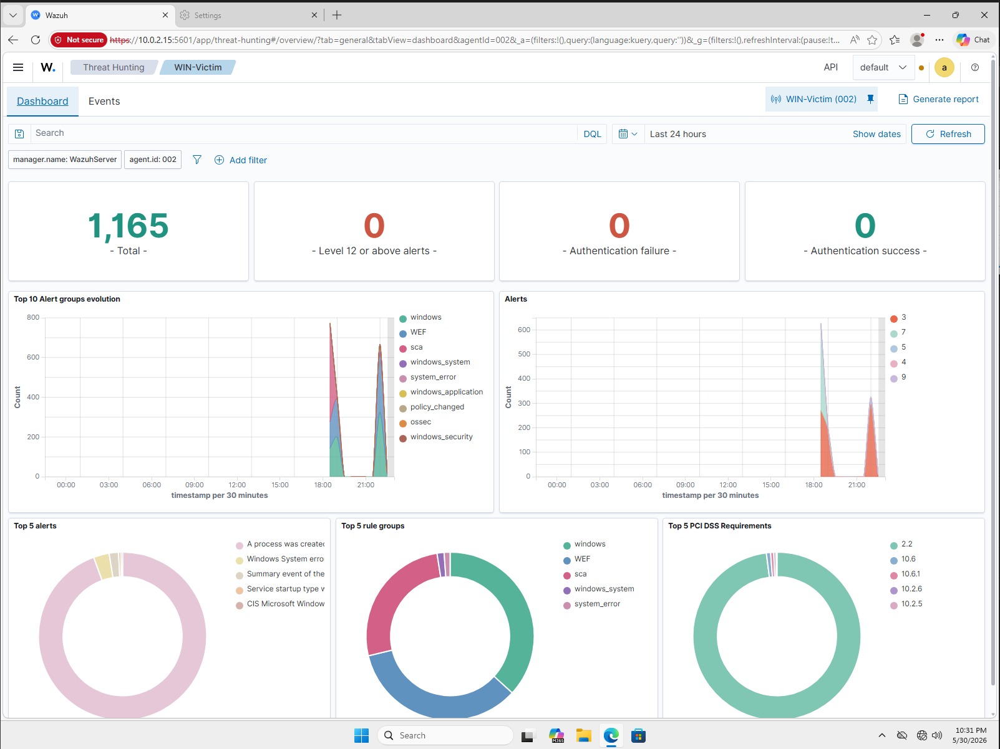
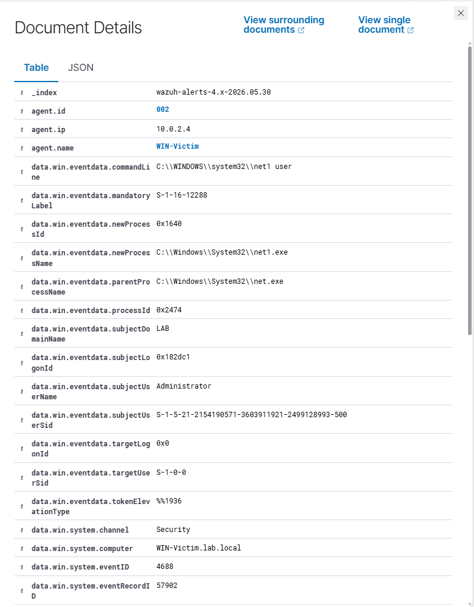
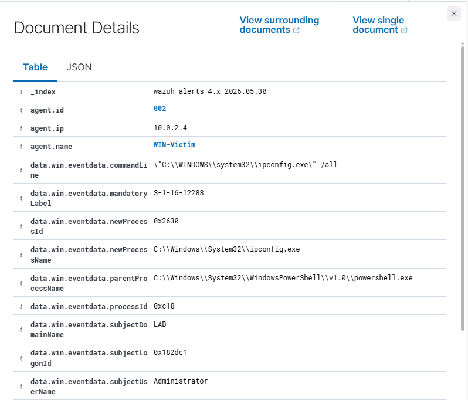
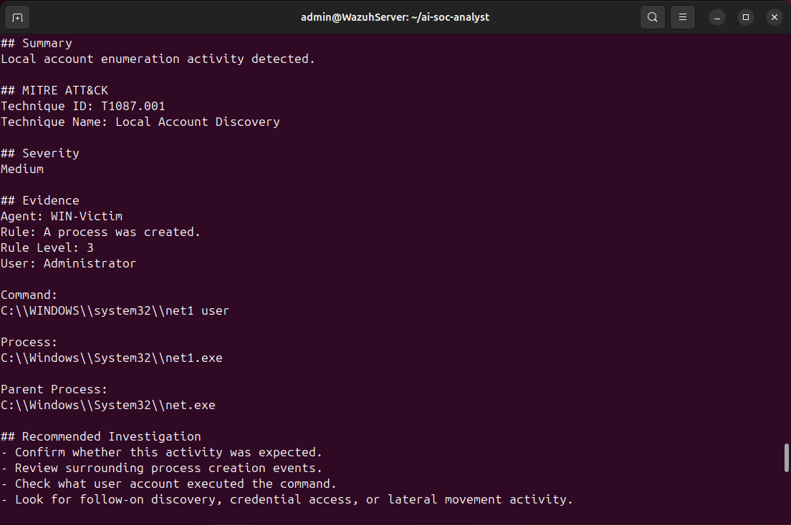

# Screenshots

This directory contains screenshots demonstrating the detection, analysis, and reporting workflow of the AI-Powered SOC Analyst project.

---

## Wazuh Dashboard

### Wazuh Overview Dashboard

[View Full Screenshot](wazuh-dashboard.png)



The Wazuh dashboard showing the monitored Windows endpoint and collected security events.

---

## Local Account Discovery Detection

[View Full Screenshot](threat-hunting-net-user.png)



This alert was generated after executing:

```text
net.exe user
```

**MITRE ATT&CK Mapping**

- T1087.001 – Local Account Discovery

---

## Network Configuration Discovery Detection

[View Full Screenshot](threat-hunting-ipconfig.png)



This alert was generated after executing:

```text
ipconfig /all
```

**MITRE ATT&CK Mapping**

- T1016 – System Network Configuration Discovery

---

## MITRE ATT&CK Enrichment

[View Full Screenshot](mitre-mapping-output.png)



The Python analysis engine automatically enriches Wazuh alerts with:

- MITRE ATT&CK Technique ID
- Technique Name
- Severity Classification
- Analyst Summary
- Investigation Recommendations

---

## Quick Navigation

| Screenshot | Description |
|------------|-------------|
| [Wazuh Dashboard](wazuh-dashboard.png) | Wazuh management dashboard |
| [net.exe user Detection](threat-hunting-net-user.png) | Local Account Discovery detection |
| [ipconfig /all Detection](threat-hunting-ipconfig.png) | Network Configuration Discovery detection |
| [MITRE Mapping Output](mitre-mapping-output.png) | Automated alert enrichment output |
