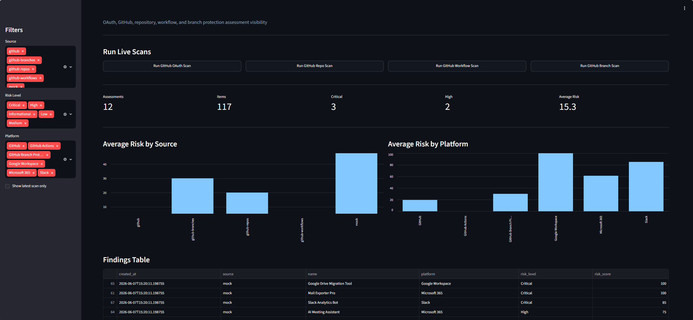
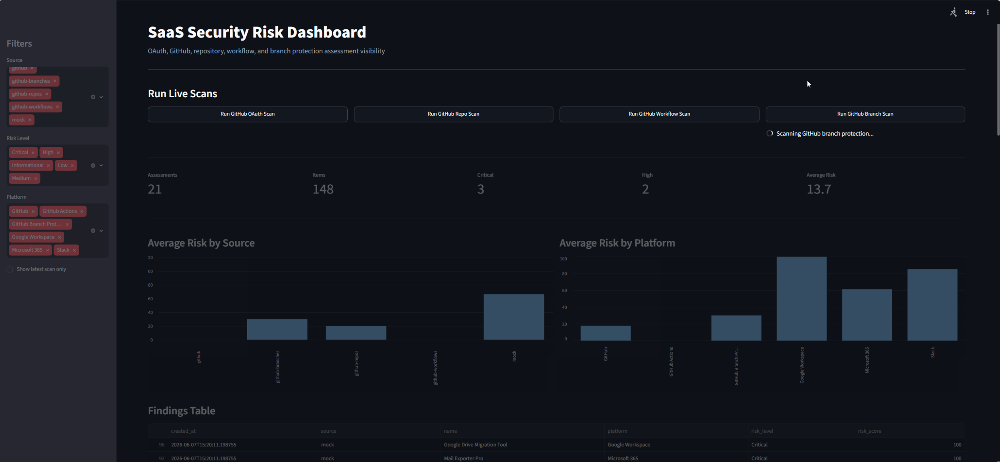
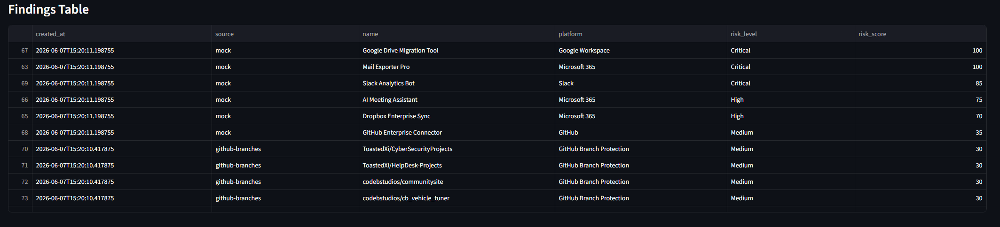
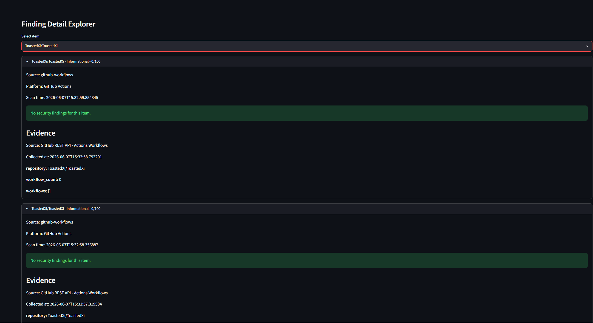
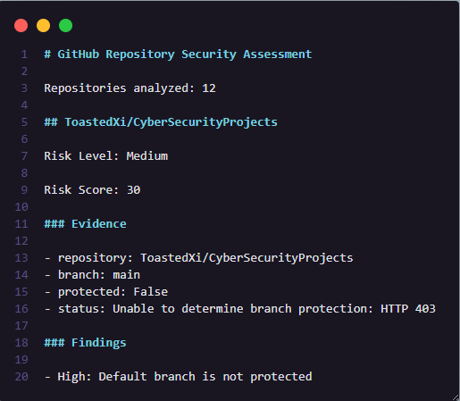
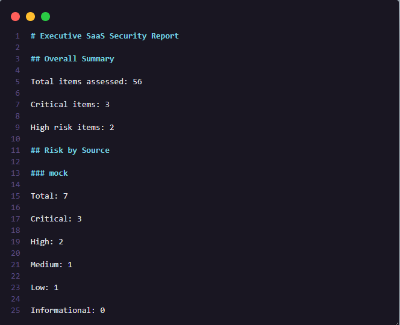

# 🛡️ SaaS Security Posture Management (SSPM) Platform

### OAuth, GitHub & Security Posture Assessment

---


---

## 📖 Overview

The **SaaS Security Posture Management (SSPM) Platform** is a security automation project designed to assess SaaS integrations, OAuth permissions, GitHub repositories, CI/CD workflows, and overall security posture.

The platform collects evidence from live SaaS environments, performs automated security analysis, generates risk findings, maps findings to the MITRE ATT&CK framework, provides remediation guidance, stores historical assessments, and visualizes results through a modern security dashboard.

The project was inspired by commercial SSPM solutions such as:

* Microsoft Defender for Cloud Apps
* Wing Security
* Obsidian Security
* Grip Security
* Nudge Security

The objective was to gain hands-on experience building a platform that provides visibility into SaaS risk, OAuth exposure, and repository security posture.

---

## 🌎 Real World Problem

Modern organizations depend heavily on SaaS applications such as:

* Microsoft 365
* Google Workspace
* GitHub
* Slack
* Salesforce
* Notion
* Atlassian

Employees frequently authorize third-party applications without security review.

These applications may receive permissions capable of:

* Reading email
* Sending email
* Accessing cloud storage
* Accessing source code
* Managing repositories
* Modifying CI/CD pipelines
* Maintaining persistent OAuth access

Security teams often struggle to answer questions such as:

* Which applications have access?
* What permissions were granted?
* Are those permissions still required?
* Are applications still actively used?
* Which integrations introduce security risk?

This project was built to simulate how security teams identify and manage those risks.

---

## 🎯 Objectives

* Collect live SaaS security evidence
* Analyze OAuth permissions and access scopes
* Identify excessive permissions
* Detect dormant integrations
* Assess repository exposure
* Evaluate GitHub Actions workflows
* Assess branch protection posture
* Generate security findings
* Map findings to MITRE ATT&CK
* Provide remediation recommendations
* Track security posture over time
* Visualize results through a security dashboard

---

## 🏗️ Architecture

```text
GitHub API
    │
    ▼
Evidence Collection
    │
    ▼
Risk Analysis Engine
    │
    ▼
MITRE ATT&CK Mapping
    │
    ▼
Remediation Engine
    │
    ▼
SQLite Database
    │
    ▼
Historical Tracking
    │
    ▼
Executive Reporting
    │
    ▼
Streamlit Dashboard
```

---

## ⚙️ Security Assessments

### 🔐 OAuth Security Assessment

The platform evaluates OAuth permissions and access scopes to identify risky integrations.

Examples include:

```text
Mail.Read
Mail.Send
Mail.ReadWrite
Files.Read.All
Files.ReadWrite.All
Directory.Read.All
offline_access
repo
workflow
admin:org
delete_repo
```

Potential findings include:

* Excessive permissions
* Dormant applications
* Unknown publishers
* Organization-wide admin consent
* Broad repository access

---

### 📦 GitHub Repository Assessment

The platform analyzes repository security posture and exposure.

Assessment areas include:

* Public repositories
* Repository visibility
* Repository ownership
* Archived repositories
* Forked repositories
* Open issues

---

### 🔁 GitHub Actions Workflow Assessment

The platform evaluates CI/CD attack surface exposure through GitHub Actions.

Assessment areas include:

* Workflow usage
* CI/CD exposure
* Repository automation
* Pipeline attack surface

---

### 🌿 Branch Protection Assessment

The platform evaluates repository governance controls.

Assessment areas include:

* Default branch protection
* Pull request review requirements
* Direct push restrictions
* Repository protection policies

---

## 🚨 Example Findings

### Medium Risk

**Public GitHub Repository Detected**

Platform: GitHub

Business Impact:

Public repositories may expose source code, documentation, and configuration information that could assist attackers during reconnaissance activities.

Recommendation:

Review repository visibility settings and restrict access where appropriate.

MITRE ATT&CK:

* T1213 – Data from Information Repositories

---

### High Risk

**Missing Branch Protection**

Platform: GitHub

Business Impact:

Production code may be modified without review, increasing the risk of unauthorized changes.

Recommendation:

Require pull request reviews and enable branch protection controls.

MITRE ATT&CK:

* T1098 – Account Manipulation

---

### Medium Risk

**Dormant SaaS Integration**

Platform: OAuth

Business Impact:

Unused applications may retain access to organizational resources and increase attack surface.

Recommendation:

Review and remove unused integrations.

MITRE ATT&CK:

* T1078 – Valid Accounts

---

## 🧠 MITRE ATT&CK Mapping

Findings are mapped to relevant ATT&CK techniques.

| Technique | Description                        |
| --------- | ---------------------------------- |
| T1078     | Valid Accounts                     |
| T1087     | Account Discovery                  |
| T1098     | Account Manipulation               |
| T1114     | Email Collection                   |
| T1213     | Data from Information Repositories |
| T1485     | Data Destruction                   |
| T1552     | Unsecured Credentials              |
| T1566     | Phishing                           |

---

## 📊 Risk Scoring Methodology

The platform assigns points to findings and calculates an overall risk score.

Example scoring:

| Finding                   | Points |
| ------------------------- | ------ |
| Mail.ReadWrite            | +35    |
| Admin Consent             | +15    |
| Dormant Application       | +20    |
| Unknown Publisher         | +15    |
| Public Repository         | +20    |
| Missing Branch Protection | +30    |

### Risk Levels

| Score  | Rating   |
| ------ | -------- |
| 0–29   | Low      |
| 30–59  | Medium   |
| 60–79  | High     |
| 80–100 | Critical |

---

## 🔍 Evidence Collection

The platform collects supporting evidence from SaaS environments to validate findings.

Example evidence:

```json
{
  "github_user": "ToastedXi",
  "public_repositories": 7,
  "repository": "ExampleRepo",
  "workflow_count": 3
}
```

All findings are supported by collected evidence to provide context and support remediation decisions.

---

## 🗄️ Historical Tracking

Assessment results are stored and tracked over time.

Historical tracking enables:

* Security posture monitoring
* Trend analysis
* Executive reporting
* Risk reduction measurement
* Security improvement tracking

Example:

```text
Assessment 1 → Risk Score 62
Assessment 2 → Risk Score 54
Assessment 3 → Risk Score 41
```

This provides visibility into how security posture changes over time.

---

## 📄 Executive Reporting

The platform generates executive-focused reports that summarize:

* Security posture
* Risk levels
* Findings
* MITRE ATT&CK mappings
* Business impact
* Remediation recommendations

```
# Executive SaaS Security Report

## Overall Summary

Total items assessed: 56

Critical items: 3

High risk items: 2

## Risk by Source

### mock

Total: 7

Critical: 3

High: 2

Medium: 1

Low: 1

Informational: 0
```

These reports are intended to support communication between security teams and leadership.

---

## 📊 Security Dashboard

A modern Streamlit dashboard was developed to visualize security posture.

### Dashboard Features

* Live scan execution
* Historical assessment tracking
* Risk metrics
* Findings explorer
* Evidence explorer
* Source filtering
* Platform filtering
* Risk filtering
* Trend visibility

### Supported Assessments

* OAuth Security Assessment
* GitHub Repository Assessment
* GitHub Actions Assessment
* Branch Protection Assessment

---

## 📸 Screenshots

### Dashboard Overview



### Live Scan Controls



### Risk Metrics



### Findings Explorer



### Evidence Viewer



### Executive Reporting



---

## 🛠️ Skills Demonstrated

### Security Engineering

* SaaS Security Posture Management (SSPM)
* OAuth Security Analysis
* MITRE ATT&CK Mapping
* Risk Assessment
* Security Automation
* Security Reporting

### Development

* Python
* REST APIs
* GitHub API Integration
* SQLite
* Streamlit Dashboard Development
* Data Processing and Analysis

### Security Operations

* Evidence Collection
* Security Monitoring
* Historical Assessment Tracking
* Executive Reporting
* Risk Prioritization
* Security Metrics

---

## 📚 Lessons Learned

Through this project I gained practical experience with:

* Building security automation workflows
* Consuming and analyzing API data
* Designing risk scoring methodologies
* Mapping findings to MITRE ATT&CK
* Developing security dashboards
* Creating executive security reports
* Storing and analyzing historical security data
* Translating technical findings into business impact

This project provided hands-on exposure to concepts commonly used within modern SaaS Security Posture Management platforms.

---

## 🔮 Future Improvements

Future enhancements may include:

* Slack Integration
* Microsoft Graph Integration
* Google Workspace Integration
* Secrets Detection
* PDF Executive Reports
* Risk Trend Visualization
* Scheduled Scanning
* Email Alerting
* Finding Lifecycle Tracking
* Security Scorecards

---

## ⚠️ Security Notice

This project was developed for:

* Defensive security research
* Security engineering practice
* Learning and education
* Portfolio development

Only assess systems, repositories, workspaces, and SaaS environments that you own or have explicit authorization to test.

---

## 👨‍💻 Author

**ToastedXi**

Cybersecurity Student | SOC Analyst | Security Automation Enthusiast

GitHub: https://github.com/ToastedXi

---

> Built to demonstrate SaaS Security Posture Management (SSPM), OAuth Security Analysis, Security Automation, Security Engineering, MITRE ATT&CK Mapping, Risk Assessment, Historical Security Tracking, and Security Dashboard Development.
